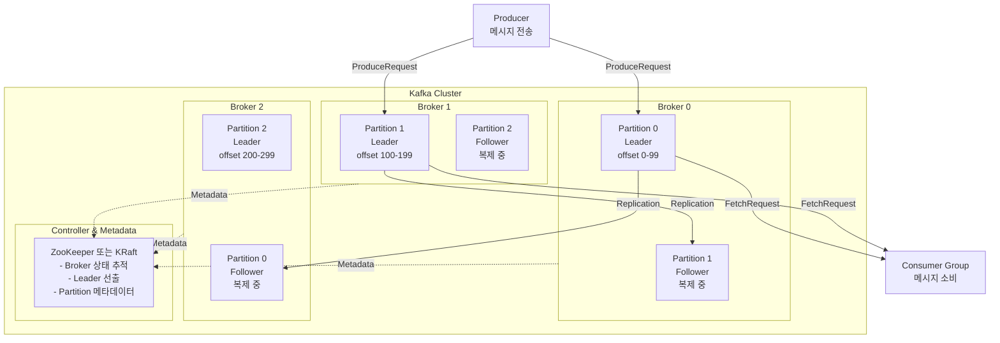
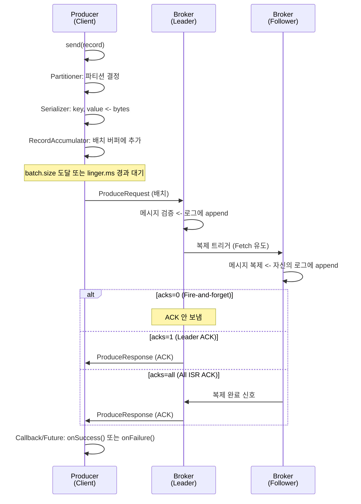
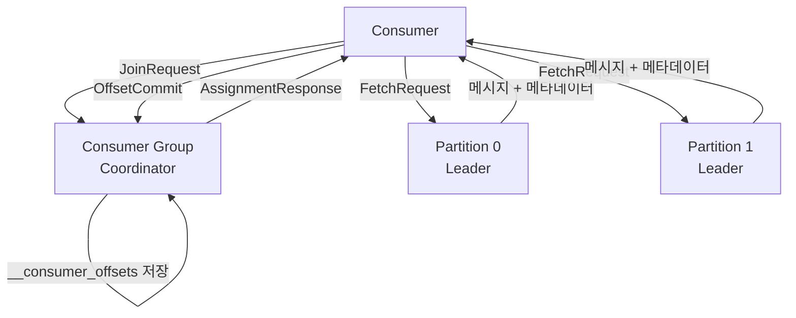

## 개요

### Kafka란?

**Apache Kafka**는 **분산 이벤트 스트리밍 플랫폼** (Distributed Event Streaming Platform)이다. 실시간으로 발생하는 대량의 데이터를 중앙 허브를 통해 수집, 저장, 처리하는 데 최적화되어 있다.

- **분산 커밋 로그**: 메시지를 영구 저장하고, 여러 consumer가 독립적으로 처리하며, 원하는 시점으로 돌아갈 수 있다
- **실시간 처리**: 초당 수백만 개의 메시지를 처리하며 2ms 수준의 낮은 지연시간 제공
- **고가용성**: 여러 브로커 간 복제로 장애 상황에서도 데이터 손실 없음
- **확장성**: 1,000개 브로커, 매일 수조 개의 메시지, 페타바이트 규모까지 확장 가능

Fortune 100의 80% 이상이 Kafka를 신뢰하고 사용 중이며, Netflix, LinkedIn, Uber 등 대규모 기업이 핵심 인프라로 활용 중이다.

### 등장 배경

Kafka는 **2011년 LinkedIn**에서 개발되었다. LinkedIn은 실시간 사용자 활동 데이터(프로필 조회, 메시지, 연결 요청 등) 처리에 직면하면서, 기존 아키텍처의 문제를 발견했다:

- **기존 문제**: 시스템 간 임시 파이프라인을 구축하다 보니 복잡성 증가
- **기존 로그 파이프라인**: 확장 가능했지만 손실이 발생하고 지연시간이 김
- **Kafka 도입**: 스트림 중심 아키텍처로 전환하여 중앙 허브 역할 수행

이를 통해 LinkedIn은 각 시스템이 중앙 파이프라인에 공급하거나 공급받을 수 있는 구조를 만들었고, 이것이 현대적 데이터 아키텍처의 표준이 되었다.

### 세 가지 핵심 기능

1. **레코드 스트림 게시 및 구독**: Producer가 메시지를 발행하고 Consumer가 구독
2. **레코드 스트림을 효과적으로 저장**: 디스크에 영구 보존하며 보존 기간 설정 가능
3. **레코드 스트림을 실시간 처리**: joins, aggregations, filters, transformations 등의 내장 처리 기능

이 글에서는 **Apache Kafka 공식 문서 기준**으로 Broker, Replication, Producer/Consumer의 동작을 완전히 이해하는 것을 목표로 한다.

---

## 1. Kafka vs 전통 메시지 큐

Kafka와 RabbitMQ의 가장 큰 차이는 **아키텍처**에 있다:

- **RabbitMQ**: 메시지 브로커 (메시지 전달 중개)
- **Kafka**: 분산 스트리밍 플랫폼 (메시지 브로커 + 저장 + 실시간 처리)

### 구조적 차이

```
기존 메시지 큐 (RabbitMQ, ActiveMQ):
├─ 메시지 전송만 중심
├─ Consumer가 읽으면 즉시 삭제
├─ 상태 추적 어려움 (어떤 Consumer가 어디까지 읽었는지 모름)
├─ 재처리 불가능 (이미 삭제된 메시지)
└─ 용도: 단순 메시징 (작업 큐 패턴)

Kafka (분산 커밋 로그):
├─ 메시지는 디스크에 영구 저장 (retention 설정으로 관리)
├─ Consumer는 독립적으로 소비 (각각 offset 관리)
├─ 여러 consumer group이 같은 메시지 재소비 가능
├─ Offset으로 재처리 가능 (시간여행 가능)
├─ Event sourcing, CQRS 패턴 지원
└─ 용도: 데이터 스트리밍, 로그 수집, 실시간 분석
```

### 비교표

| 특성 | Kafka | RabbitMQ |
|------|-------|----------|
| 아키텍처 | 분산 스트리밍 플랫폼 | 메시지 브로커 |
| 메시지 저장 | 디스크 영속 저장 | 메모리 (승인 후 삭제) |
| 확장성 | 매우 높음 (파티션 기반 수평 확장) | 중간 수준 (큐 기반) |
| 처리량 | 매우 높음 (초당 수백만 메시지) | 중간 수준 |
| 지연시간 | 매우 낮음 (2ms) | 낮음 |
| 재처리 | ✅ 가능 | ❌ 불가능 |
| 다중 소비자 | ✅ 가능 (완전히 독립적) | ⚠️ 제한적 |
| 데이터 복제 | 자동 복제 | 수동 구성 필요 |
| 사용 사례 | 스트리밍 분석, 로그 집계, 데이터 파이프라인 | 작업 큐, 실시간 통신, 마이크로서비스 메시징 |

---

## 2. Event Streaming이란?

Kafka의 핵심은 **Event Streaming**이다.

### 기본 개념

**스트림(Stream)**: 시간에 따라 **연속적으로 발생하는 데이터의 흐름**
- 실시간 주식 거래 데이터
- SNS 피드와 사용자 활동
- IoT 센서에서의 온도, 습도 측정
- 웹 서버의 접속 로그

**스트리밍(Streaming)**: 스트림 데이터를 **실시간으로 처리**하는 과정
- 들어오는 데이터를 즉시 처리
- 저장된 데이터를 나중에 분석
- 모든 과거 데이터를 처리 가능

### Event Streaming의 세 가지 단계

```
┌─────────────────┐
│    캡처 (C)     │  Producer가 이벤트를 Kafka에 송신
│ Event Source    │  - 웹 클릭 이벤트
│                 │  - 센서 데이터
│                 │  - 결제 트랜잭션
└────────┬────────┘
         ↓
    [Kafka]  <- 중앙 허브: 데이터를 수집하고 저장
         ↓
┌────────┬────────┬─────────┐
│ 저장(S)│ 처리(P)│ 분석(A) │
│ Store  │Process │Analyze  │
│        │        │         │
│ DB, S3 │Streams │Analytics│
└────────┴────────┴─────────┘

장점:
- 데이터의 일관성 유지
- 시스템 전체 복잡성 감소
- A->Z로의 대규모 데이터 동시 전달
```

### Event Streaming의 역할

```
캡처 (Capture)
├─ Producer가 이벤트를 Kafka에 송신
├─ 예: 사용자 로그인, 주문 생성, 결제 완료

저장 (Store)
├─ 디스크에 영구 보존 (복제, 백업)
├─ 보존 기간 설정 가능 (일부만, 무제한 등)

처리 (Process)
├─ Consumer들이 독립적으로 이벤트 처리
├─ 실시간 알림, 대시보드 업데이트

재처리 (Replay)
├─ Offset으로 과거로 돌아가 재실행
├─ 알고리즘 업데이트 시 재계산 가능
```

### 왜 Event Streaming이 중요한가?

#### 문제: 전통 방식의 강한 결합

```
API Call 기반: 동기식 직접 통신
Service A -> [slow/down] -> Service B
         -> Service C
         -> Service D

문제:
- B가 느리거나 다운되면 A도 영향
- 모든 서비스가 실시간으로 응답해야 함
- 각 서비스마다 직접 연결 필요 (n² 복잡성)
- 장애 전파 가능성
```

#### 해결: Event Streaming으로 느슨한 결합

```
Kafka 기반: 비동기 간접 통신
          -> [Service B] (독립적 속도)
Service A -> [Kafka] -> [Service C] (독립적 속도)
          -> [Service D] (독립적 속도)

장점:
- A는 B, C, D의 상태를 몰라도 됨
- 각 서비스가 자신의 속도로 처리 가능
- 나중에 새로운 Consumer 추가 가능 (A 수정 불필요)
- 장애가 다른 서비스로 전파되지 않음
- 과거 데이터 재처리 가능 (새로운 Consumer는 과거부터 시작 가능)
```

### 실제 사용 사례

| 사례 | 설명 |
|------|------|
| **사용자 활동 추적** | 웹사이트 클릭, 페이지 뷰, 체류시간을 실시간 수집 후 분석 |
| **로그 수집** | 여러 마이크로서비스의 로그를 중앙화하여 모니터링 |
| **실시간 알림** | 주문 상태 변화, 결제 완료 등을 즉시 고객에게 통지 |
| **데이터 동기화** | 데이터베이스 변경사항을 실시간으로 다른 시스템에 반영 |
| **머신러닝** | 데이터 스트림 학습으로 실시간 예측 모델 업데이트 |
| **메트릭 수집** | CPU, 메모리 등 성능 지표를 실시간 수집 후 알람 |

---

---

## 3. Cluster 아키텍처

### 성능 특징

Kafka 클러스터는 다음 성능을 제공한다:

| 특성 | 수치 |
|------|------|
| 처리량 (Throughput) | 초당 수백만 개 메시지 |
| 지연시간 (Latency) | 2ms 이하 |
| 확장성 | 1,000개 브로커까지 확장 |
| 일일 처리량 | 수조 개 메시지 |
| 저장 용량 | 페타바이트 규모 |
| 파티션 개수 | 수십만 개 |
| 가용성 | 여러 지역(AZ) 걸쳐 배포 |

### 클러스터 아키텍처 다이어그램



### 핵심 개념

| 개념 | 설명 |
|------|------|
| **Broker** | Kafka 서버 노드 하나. 메시지 저장, 복제 관리, Producer/Consumer 요청 처리 |
| **Cluster** | 여러 Broker의 모임. 병렬성 및 고가용성 제공 |
| **Topic** | 메시지의 카테고리 (예: "주문", "결제", "사용자") |
| **Partition** | Topic을 나누는 단위. 병렬성의 근원. 각 Partition은 Leader + Followers로 구성 |
| **Leader** | Partition의 주 복제본. 모든 읽기/쓰기를 처리. 장애 시 Follower로 대체 |
| **Follower** (ISR) | Partition의 복제본. Leader와 동기화 유지. Leader 장애 시 자동 승격 |
| **Offset** | Partition 내 메시지의 위치. Consumer가 어디까지 읽었는지 추적 |
| **Controller** | 클러스터 조정 역할. Leader 선출, Broker 상태 관리 |
| **Replication Factor** | 각 Partition이 몇 개의 복제본을 가질지 (보통 3) |
| **ISR** (In-Sync Replicas) | Leader와 동기화된 Follower 집합. 이 중에서만 새 Leader 선출 |

---

## 4. Metadata 관리: ZooKeeper vs KRaft

### Metadata란?

**Metadata** = "데이터에 대한 정보"

Kafka에서 관리하는 metadata:
- Topic은 몇 개의 Partition으로 나뉘어 있나?
- 각 Partition의 Leader(주인) Broker는 어디?
- 각 Partition의 Follower(복제본)는 어디?
- 현재 어느 Broker가 장애 상태인가?

**왜 필요한가?**
- Producer: "이 메시지를 어느 Broker에 보낼까?" 알기 위해
- Consumer: "이 토픽의 메시지가 어디에 있나?" 알기 위해

### ZooKeeper 모드 (기존, Kafka 3.2 이전)

**역할**: Partition의 Leader를 선출하고, Broker의 상태를 관리

**작동 방식**:

```
1. Broker 등록
   Broker 0, 1, 2 -> ZooKeeper에 "나 살아있어" 등록

2. Partition Leader 선출
   ZK: "Partition 0의 Leader는 누구? 투표해봐"
   (최대한 빨리 따라잡은 Replica를 선출)

3. 상태 모니터링
   Broker 0: "Broker 1 느려졌네..." (heartbeat 느림)
   ZK: "Broker 1 ISR에서 제거"
   
4. 장애 복구
   Broker 0: (크래시)
   ZK: "Broker 0 없다! Partition 0의 새 Leader를 ISR 중에서 선출"
   -> Broker 2 선출 -> 모든 Broker에 알림

5. 복구 후
   Broker 0: (재시작)
   ZK: "Broker 0 있네? ISR에 재추가"
```

### KRaft 모드 (신규, Kafka 3.3+)

**핵심**: ZooKeeper 없이 Kafka 자체가 metadata를 관리 (Raft protocol 사용)

**작동 방식**:

```
1. Controller 선출 (Raft 투표)
   Broker 0, 1, 2가 자체 투표
   -> 과반수 동의로 Controller 선출 (예: Broker 0)

2. Metadata 저장 (내부 Topic)
   Controller: Partition Leader 정보를 특별한 Topic(__cluster_metadata)에 저장
   -> 모든 Broker가 복제하면서 보관

3. 결정 및 적용
   Controller: "Partition 0의 Leader는 Broker 2"
   -> 결정을 metadata에 기록
   -> 모든 Broker가 동기화

4. 장애 복구
   Controller (Broker 0): (크래시)
   -> 자동으로 새 투표
   -> Broker 1이 새 Controller
   -> Broker 2에서 metadata 복구
   -> 시스템 계속 작동
```

**vs ZooKeeper의 차이**:
- ZooKeeper: 외부 독립 시스템, 별도 설치 필요
- KRaft: Kafka 내부, 통합 관리

---

## 5. Replication과 ISR (In-Sync Replicas)

### Replication이란?

**Replication** = "같은 데이터를 여러 Broker에 복제"

**ISR (In-Sync Replicas)** = "Leader와 동기화된 Replica(복제본)들"

**왜 필요한가?**
- Broker 1에만 메시지가 있다가 Broker 1이 다운 -> 메시지 모두 손실! 😱
- 해결책: Broker 1, 2, 3에 같은 메시지를 저장 -> 1개 다운되어도 안전 ✅

**ISR만 특별한 이유:**
- ISR = Leader와 거의 같은 최신 데이터를 가진 것들
- ISR 밖 = 오래된 데이터를 가진 것들
- Leader 장애 시 ISR에서만 새 Leader 선출 -> 데이터 손실 최소화

### Leader와 Follower의 역할

```
Producer -> Broker 0 (Leader) ✅ 즉시 저장
              ↓ (따라잡기)
           Broker 1 (Follower) ✅ 복제
              ↓ (따라잡기)
           Broker 2 (Follower) ✅ 복제
```

- **Leader**: 모든 읽기/쓰기 처리 (빠름)
- **Follower**: Leader의 데이터 복제 (따라잡기)

### ACK 정책 (acks 설정)

| 정책 | 동작 | 속도 | 손실 위험 | 사용처 |
|------|------|------|----------|--------|
| `acks=0` | Broker에 보내고 응답 안 기다림 | 매우 빠름 | 높음 | 로그 |
| `acks=1` | Leader만 확인 (기본값) | 빠름 | 중간 | 대부분 |
| `acks=all` | Leader + Follower 모두 확인 | 느림 | 낮음 | 금융, 주문 |

**작동 방식**:

```
acks=1 (권장 - 균형)
├─ Producer -> Broker 0 (Leader)
├─ Broker 0: "받았어!" (즉시)
├─ Producer: 응답받고 다음 메시지
└─ (동시에) Broker 1, 2: 복제 진행

acks=all (안전 - 느림)
├─ Producer -> Broker 0 (Leader)
├─ Broker 0 -> Broker 1, 2: "받아?"
├─ Broker 1, 2: "받았어!"
├─ Broker 0: "모두 받았대" -> Producer에 응답
└─ Producer: 응답받고 다음 메시지
```

### ISR (In-Sync Replicas)

**핵심**: ISR에 속한 Broker만 새 Leader 후보

```
Partition 0
├─ Leader: Broker 0
├─ ISR = [0, 1, 2]  <- 모두 따라잡은 상태
└─ Non-ISR: []

만약 Broker 0이 크래시:
-> ISR [0, 1, 2] 중에서만 새 Leader 선출
-> Broker 2 선출 (최신 데이터 가짐)
-> 데이터 손실 최소화 ✅

만약 Broker 1이 느려짐:
├─ replica.lag.time.max.ms 초과
├─ ISR = [0, 2] (Broker 1 제외)
├─ Broker 1이 따라잡으면
└─ ISR = [0, 1, 2] (복구)
```

**왜 ISR만?**
- ISR 멤버 = Leader와 거의 같은 데이터
- 다른 Broker = 오래된 데이터 -> Leader 되면 손실!

---

## 6. Log 구조 (디스크 저장소)

### Log란?

**Log** = "메시지들이 순서대로 저장된 파일들"

**Segment** = "Log를 여러 개의 작은 파일로 나눈 것"

**왜 여러 파일로 나누나?**
- 한 개 파일이 너무 크면 -> 검색 느림, 관리 어려움
- 여러 파일로 나누면 -> 빠른 검색, 효율적 관리

**각 파일이 저장하는 offset 범위:**
- `00000000000000000000.log`: offset 0 ~ 999
- `00000000000000001000.log`: offset 1000 ~ 1999
- `00000000000000002000.log`: offset 2000 ~ 2999

### Segment 파일 구성

Partition의 메시지는 여러 Segment 파일로 나뉘어 저장된다.

```
Partition 0 디렉토리:

00000000000000000000.log        <- offset 0부터 시작
00000000000000000000.index
00000000000000000000.timeindex

00000000000000001000.log        <- offset 1000부터 시작
00000000000000001000.index
00000000000000001000.timeindex

00000000000000002000.log        <- 현재 활성 (쓰기 중)
00000000000000002000.index
leader-epoch-checkpoint
```

**파일명 규칙**:
- 파일명 숫자 = 그 파일의 시작 offset
- 예: `00000000000000001000.log` -> offset 1000부터 메시지 저장
- 예: `00000000000000002000.log` -> offset 2000부터 메시지 저장

### Segment 생성 규칙

새로운 Segment 파일은 다음 중 하나 조건을 만족하면 자동 생성:

| 조건 | 설정값 | 의미 |
|------|--------|------|
| 파일 크기 | `log.segment.bytes` (기본 1GB) | 1GB에 도달하면 새 파일 |
| 시간 경과 | `log.roll.ms` (기본 168시간/7일) | 7일이 지나면 새 파일 |

**목적**: 
- 개별 파일 관리 용이
- 검색 성능 향상 (전체 스캔 대신 일부만)
- 손상 시 영향 범위 최소화

### 각 파일의 역할

| 파일 타입 | 역할 |
|----------|------|
| **.log** | 실제 메시지 데이터 저장 |
| **.index** | Offset을 파일의 바이트 위치에 매핑 (빠른 검색) |
| **.timeindex** | 메시지의 timestamp를 기반으로 검색 |
| **leader-epoch-checkpoint** | Leadership 변경 이력 기록 |

**Index 파일 예시**:
```
Offset 0    -> 바이트 0
Offset 100  -> 바이트 4,512
Offset 200  -> 바이트 9,024
Offset 300  -> 바이트 13,536

Consumer가 offset 250 요청
-> index에서 offset 200 (바이트 9,024) 찾음
-> 바이트 9,024부터 순차 읽기 시작
-> offset 250 도달 시 반환
```

### Checkpoint Files (복구용)

Broker 디렉토리에 저장되는 2가지 Checkpoint 파일:

| 파일 | 역할 |
|------|------|
| **replication-offset-checkpoint** | 모든 Replica가 받은 최신 offset 기록 |
| **recovery-point-offset-checkpoint** | 디스크에 실제로 기록된 offset 기록 |

**용도**:
- Broker 재시작 시 어디부터 복구할지 판단
- Follower 복제 상태 추적

### Message Format v2 (바이너리 구조)

**Message Format v2**는 Kafka 0.11부터 도입된 바이너리 포맷이다. 각 레코드 배치(RecordBatch)는 다음 구조를 따른다:

#### RecordBatch Header (배치 메타데이터)

```
baseOffset: int64 (8B)
    <- 배치의 첫 번째 레코드의 offset

batchLength: int32 (4B)
    <- 배치의 총 길이 (magic부터 마지막 레코드까지)

partitionLeaderEpoch: int32 (4B)
    <- Partition Leader의 epoch (Leader 변경 추적)
    <- Leader 변경 시마다 증가

magic: int8 (1B)
    <- 메시지 포맷 버전 (v2 = 2)

crc: uint32 (4B)
    <- CRC32 체크섬 (attributes부터 마지막까지 계산)
    <- 네트워크/디스크 전송 중 손상 감지

attributes: int16 (2B)
    <- 비트 플래그 조합:
    <- bit 0~2: 압축 방식
    <-   0: 압축 없음
    <-   1: gzip
    <-   2: snappy
    <-   3: lz4
    <-   4: zstd
    <- bit 3: 타임스탐프 타입 (0: CreateTime, 1: LogAppendTime)
    <- bit 4: 트랜잭션 배치 여부 (1 = 트랜잭션)
    <- bit 5: 제어 배치 여부 (1 = abort/commit 제어 메시지)
    <- bit 6: 삭제 타임스탐프 설정 (Log Compaction용)
    <- bit 7~15: 예약됨

lastOffsetDelta: int32 (4B)
    <- 배치 내 마지막 레코드의 offset delta
    <- 예: baseOffset=100, lastOffsetDelta=9 -> 마지막 offset=109

baseTimestamp: int64 (8B)
    <- 배치의 첫 번째 레코드 타임스탐프 (밀리초)

maxTimestamp: int64 (8B)
    <- 배치 내 가장 최근 타임스탐프 (밀리초)

producerId: int64 (8B)
    <- Producer의 세션 ID (트랜잭션/멱등성 추적)

producerEpoch: int16 (2B)
    <- Producer 세션의 epoch (세션 변경 시 증가)

baseSequence: int32 (4B)
    <- 배치의 첫 번째 레코드 sequence 번호
    <- 멱등성: Producer가 중복 제거에 사용

recordsCount: int32 (4B)
    <- 배치에 포함된 레코드 개수

records: [Record]
    <- 각 개별 레코드
    <- 압축 설정 시 압축된 상태로 저장
    <- 타임스탐프는 baseTimestamp + delta로 인코딩
```

#### v0/v1 대비 v2의 개선사항

| 항목 | v0/v1 | v2 |
|------|-------|-----|
| **배치 단위** | 개별 레코드 | 레코드 배치 |
| **압축** | 전체 배치 재압축 | 레코드별 상대 인코딩 |
| **멱등성** | 미지원 | producerId + sequence로 중복 제거 |
| **트랜잭션** | 미지원 | transactional bit + 제어 메시지 |
| **타임스탐프** | 각 레코드 전체 기록 | baseTimestamp + delta로 압축 |
| **저장 공간** | - | 30-40% 감소 |

#### 구체적 예시

```
배치: recordsCount=3, 압축 없음
baseOffset: 100
batchLength: 120
magic: 2
attributes: 0 (압축 없음)
lastOffsetDelta: 2
baseTimestamp: 1631234567890
producerId: 12345
baseSequence: 0

레코드 0:
  offsetDelta: 0
  timestampDelta: 0
  key: "user_123"
  value: {"action":"login"}

레코드 1:
  offsetDelta: 1
  timestampDelta: 50
  key: "user_456"
  value: {"action":"view"}

레코드 2:
  offsetDelta: 2
  timestampDelta: 100
  key: null
  value: null (tombstone - 삭제 표시)

결과:
Offset 100: user_123, timestamp 1631234567890
Offset 101: user_456, timestamp 1631234567940
Offset 102: deleted
```

**출처:** [Apache Kafka - Message Format](https://kafka.apache.org/documentation/#messageformat)

### Sparse Index (빠른 조회)

```
인덱스 파일의 목적: Offset으로 파일 위치 빠르게 찾기

00000000000000000000.index:
[Offset: 0]   [Position: 0]
[Offset: 100] [Position: 4512]
[Offset: 200] [Position: 9024]
[Offset: 300] [Position: 13536]

조회 프로세스 (offset 250):
1. Index 파일에서 offset <= 250인 최대값 찾기
   -> Offset 200, Position 9024
2. log 파일의 위치 9024에서 읽기 시작
3. Offset 201, 202, ..., 250 스캔
4. 메시지 반환

성능: O(log N) (N = 총 메시지 수)
```

---

## 7. Log Compaction (Event Sourcing용)

Kafka는 두 가지 보존 정책:

### Time-based Retention (기본)

```
retention.ms=604800000  # 7일

시간 흐름:
Day 0: [msg0][msg1][msg2]...[msg1000]
Day 3: [msg1000]...[msg2000] (msg0-999 삭제)
Day 7: [msg2000]...[msg3000] (msg1000-1999 삭제)

특징: FIFO 삭제
```

### Log Compaction (압축 정책)

```
cleanup.policy=compact

특징:
- 각 key의 최신 값만 유지
- 중간 버전 삭제
- 첫 offset 유지 (offset 재할당 X)

예: 사용자 상태 Topic
Offset 0: user_123 -> {status: active}
Offset 1: user_456 -> {status: inactive}
Offset 2: user_123 -> {status: premium}   <- 최신
Offset 3: user_456 -> {status: active}    <- 최신

Compaction 후:
Offset 0: [삭제됨]
Offset 1: [삭제됨]
Offset 2: user_123 -> {status: premium}
Offset 3: user_456 -> {status: active}

이점:
- 새 Consumer가 현재 상태만 빠르게 catch-up
- 스토리지 효율 (최신 값만)
- State store 복구 (Event Sourcing, CQRS)
```

---

## 8. 배치 처리 메커니즘

### Batch란?

**배치(Batch)**: 여러 메시지를 모아서 한 번에 Broker로 보내는 단위

Kafka는 높은 처리량을 위해 개별 메시지 1개마다 요청을 보내지 않고, 여러 메시지를 묶어서 한 번에 전송합니다.

#### 배치 없이 vs 배치 사용

**배치 없이** (1메시지 = 1요청):
```
Producer:
  메시지 1 -> ProduceRequest 1 -> Broker
  메시지 2 -> ProduceRequest 2 -> Broker
  메시지 3 -> ProduceRequest 3 -> Broker

문제:
  - 네트워크 오버헤드 높음 (요청 3개)
  - 네트워크 왕복(RTT) 3회
  - 처리량 낮음
  - CPU/메모리 낭비
```

**배치 사용** (N메시지 = 1요청):
```
Producer:
  메시지 1 \
  메시지 2  > RecordAccumulator 모음
  메시지 3 /
                |
                v
           ProduceRequest 1 -> Broker

장점:
  - 네트워크 오버헤드 낮음 (요청 1개)
  - 네트워크 왕복(RTT) 1회
  - 처리량 높음 (초당 수백만 메시지 가능)
  - 리소스 효율
```

#### 실제 예시

```
초당 10,000개 메시지가 들어올 때:

배치 없음:
  -> 초당 ProduceRequest 10,000개
  -> 네트워크 포화 ❌
  -> 지연시간 증가

배치 사용 (batch.size = 16KB, 평균 1KB/메시지):
  -> 배치당 약 16개 메시지
  -> 초당 ProduceRequest 약 625개 (10,000 ÷ 16)
  -> 네트워크 부하 1/16 감소 ✅
  -> 처리량 16배 증가
```

### 배치 생성 조건

Producer의 RecordAccumulator가 메시지를 모았다가, 다음 **중 먼저 도달하는 조건**에서 배치를 생성하고 Broker로 전송:

```
조건 1: batch.size 도달
  <- 설정: batch.size (기본값: 16KB = 16384 bytes)
  <- 의미: 누적된 메시지가 batch.size에 도달하면 즉시 전송
  <- 특징: 크기 기반, 예측 가능

조건 2: linger.ms 경과
  <- 설정: linger.ms (기본값: 0ms)
  <- 의미: batch.size에 도달하지 않아도, linger.ms 후 전송
  <- 특징: 시간 기반, 지연시간 제어
  <- 예: linger.ms=100
         └─ 메시지 도착 후 100ms 동안 대기하며 더 모음
         └─ 100ms 경과 시 배치가 비어도 전송

조건 3: Producer 강제 종료
  <- flush() 호출 시 즉시 배치 생성 및 전송
  <- close() 호출 시 모든 배치 전송 후 종료

-> 먼저 도달하는 조건이 배치를 생성
```

### 트레이드오프: 처리량 vs 지연시간

| 설정 | 효과 | 처리량 | 지연시간 |
|------|------|--------|---------|
| `batch.size` 크게 (예: 32KB) | 더 많이 모음 | ↑ 높음 | ↑ 높음 (느림) |
| `batch.size` 작게 (예: 4KB) | 적게 모음 | ↓ 낮음 | ↓ 낮음 (빠름) |
| `linger.ms` 크게 (예: 100ms) | 오래 대기 | ↑ 높음 | ↑ 높음 (느림) |
| `linger.ms` 작게 (예: 0ms) | 즉시 전송 | ↓ 낮음 | ↓ 낮음 (빠름) |

#### 최적화 전략

**높은 처리량이 필요한 경우** (로그 수집, 이벤트 스트리밍):
```properties
batch.size=32KB        # 크게
linger.ms=100          # 시간 대기
compression.type=snappy # 압축으로 전송 크기 감소
buffer.memory=64MB      # 버퍼 크기 확대
```

**낮은 지연시간이 필요한 경우** (실시간 알림, 주문 처리):
```properties
batch.size=4KB         # 작게
linger.ms=0            # 즉시 전송
compression.type=none  # 압축 오버헤드 제거
```

### RecordBatch 물리 구조

배치가 실제로 저장되는 포맷 (Message Format v2):

```
RecordBatch Header:
├─ baseOffset: 배치 내 첫 레코드의 offset
├─ batchLength: 전체 배치 크기 (바이트)
├─ attributes: 압축 방식, 트랜잭션 여부 등
├─ lastOffsetDelta: 배치 내 마지막 레코드의 상대 위치
├─ baseTimestamp: 첫 레코드의 타임스탐프
├─ producerId: 멱등성/트랜잭션용 Producer ID
├─ baseSequence: 첫 레코드의 sequence number
├─ recordsCount: 배치에 포함된 레코드 개수
│
└─ Records (개별 메시지들):
   ├─ Record 1: {offsetDelta, timestampDelta, key, value, headers}
   ├─ Record 2: {offsetDelta, timestampDelta, key, value, headers}
   └─ Record N: {offsetDelta, timestampDelta, key, value, headers}
```

**최적화 포인트:**
- 타임스탐프: `baseTimestamp + delta` 형태로 저장 공간 절약 (ms 단위)
- 압축: 전체 배치를 한 번에 압축 (gzip, snappy, lz4, zstd)
- 레코드당 헤더: 추적용 메타데이터 (선택적)

---

## 9. Producer 요청 흐름 (Protocol 사양)

Producer가 메시지를 보내는 전체 과정:



### ProduceRequest/Response 프로토콜

**ProduceRequest 구조** (Apache Kafka Protocol):

```
ProduceRequest => RequiredAcks Timeout [TopicName [Partition MessageSetSize MessageSet]]
                 
RequiredAcks: int16
  <- 0: Broker는 응답 안 보냄 (fire-and-forget)
  <- 1: Leader만 로그에 기록되면 ACK 보냄 (기본값)
  <- -1: 모든 ISR이 복제되면 ACK 보냄 (Most Safe)

Timeout: int32 (밀리초)
  <- Broker가 RequiredAcks를 기다리는 최대 시간
  
TopicName: 대상 topic
Partition: 대상 partition
MessageSet: 실제 메시지 배치 (위에서 설명한 RecordBatch)

ProduceResponse => [TopicName [Partition ErrorCode Offset [Timestamp]]]

ErrorCode: 성공(0) 또는 실패 원인
Offset: 메시지가 저장된 offset
Timestamp: Message Format v2에서만 반환
```

### Producer 내부 동작 단계

**1단계: Metadata 조회** (첫 송신 시)

```
클라이언트:
  Producer -> Broker: MetadataRequest (topic)

브로커 응답:
  <- Topic의 Partition 개수
  <- 각 Partition의 Leader Broker ID
  <- Replica 목록
  <- ISR 목록

클라이언트:
  -> metadata.max.age.ms 동안 캐시
  -> 주기적으로 갱신 (Broker 변경 감지)
```

**2단계: Partitioner** (어느 파티션으로 보낼지 결정)

```
키가 있는 경우:
  partition = hash(key) % num_partitions
  <- 같은 키는 항상 같은 파티션으로
  <- 순서 보장 가능

키가 없는 경우:
  partition = round_robin() 또는 sticky assignment
  <- 배치 효율 최적화
```

**3단계: RecordAccumulator** (배치 버퍼)

```
각 메시지:
  send(ProducerRecord) -> RecordAccumulator 큐에 추가
  
배치 조건:
  - batch.size 도달 (기본 16KB)
    또는
  - linger.ms 경과 (기본 0ms = 즉시 전송)
  
배치 생성:
  -> ProduceBatch 생성
  -> Sender Thread 대기열에 추가
  
메모리 관리:
  - buffer.memory: 전체 버퍼 크기 (기본 32MB)
  - 초과 시 send() 호출 대기
```

**4단계: Sender Thread** (백그라운드 스레드)

```
각 ProduceBatch마다:
  1. Leader Broker 확인 (Metadata로부터)
  2. TCP 연결 유지 (connections.max.idle.ms)
  3. 메시지 압축 (설정에 따라)
     <- compression.type: none, gzip, snappy, lz4, zstd
  4. ProduceRequest 송신
  5. ProduceResponse 대기 (request.timeout.ms)
  
재시도:
  - 실패 시 retries 횟수만큼 재시도
  - 지수 백오프: retry.backoff.ms
```

**5단계: Broker 처리**

```
Leader Broker:
  1. Authorization 확인 (ACL)
  2. 메시지 포맷 검증
  3. 로그에 append (메모리의 Page Cache)
  4. Flush Policy 확인 (log.flush.interval.ms 등)
  5. Follower 복제 추적
  
Follower Broker:
  1. FetchRequest로 메시지 복제 (자동)
  2. 자신의 로그에 append
  
ACK 정책 적용:
  - acks=0: append 즉시 응답
  - acks=1: Leader append 후 응답
  - acks=all: 모든 ISR append 후 응답
```

### RequiredAcks (acks) 정책 비교

| Acks 값 | 동작 | 지연시간 | 데이터 손실 위험 |
|---------|------|---------|----------------|
| **0** | Broker 응답 안 대기 | 최소 | 높음 (Broker 실패 시) |
| **1** | Leader만 기록 | 중간 | 중간 (Leader 실패 후 선출 전 손실 가능) |
| **-1** (all) | 모든 ISR 기록 | 최대 | 최소 (ISR 전체 실패 불가능) |

### Idempotent Producer (중복 방지)

**문제 상황:**

```
시나리오: acks=1, 네트워크 지연
1. Producer -> Broker: ProduceRequest (메시지)
2. Broker: 메시지 저장 완료
3. Broker -> Producer: ProduceResponse 전송
4. 네트워크 지연: ProduceResponse 손실
5. Producer: 타임아웃 -> 재전송
6. Broker: 같은 메시지 저장 -> 중복 발생!

결과: "At Least Once" (최소 1회 이상)
```

**해결책: Idempotent Producer** (Kafka 0.11+, Kafka 3.0+ 기본값)

```
설정:
  props.put("enable.idempotence", true);
  props.put("acks", "all");
  props.put("retries", 5);

메커니즘: ProducerId + Sequence Number

1. 각 Producer 세션에 고유 ProducerId 할당
2. 각 메시지마다 증가하는 Sequence Number 부여
3. Broker에서 (ProducerId, Sequence) 추적
   저장된 최고 Sequence: highwater mark

Sequence 검증:
  ├─ 신규 메시지 (Sequence = highwater + 1)
  │  <- 수용, 로그에 append
  ├─ 재전송 (Sequence <= highwater)
  │  <- 무시 (캐시에서 duplicate check)
  └─ 순서 위반 (Sequence > highwater + 1)
     <- 에러 반환 (호출자가 재시도)

결과: "Exactly Once" (정확히 1회)
```

**Per-Partition Sequencing (파티션별 추적):**

멱등성은 **파티션별로** 독립적으로 추적됩니다:

```
Topic "orders", 3 Partitions:

Partition 0:
  (ProducerId=123, Sequence): 0, 1, 2, 3, 4
  <- 동일 Producer가 보낸 메시지들

Partition 1:
  (ProducerId=123, Sequence): 0, 1, 2, 3
  <- 다른 파티션이므로 별도 카운트

Partition 2:
  (ProducerId=123, Sequence): 0, 1
  <- 마찬가지로 독립적

-> 같은 Producer여도 각 Partition마다 sequence는 0부터 시작
```

**Duplicate Detection (중복 감지 상세)**

```
Broker에서 메시지 수신 시:

상황 1: 정상 메시지 (신규)
  Sequence = highwater + 1
  ✓ 로그에 append
  ✓ ProduceResponse ACK 전송
  ✓ highwater = Sequence로 업데이트

상황 2: 정확한 재전송
  Sequence = highwater (이미 저장됨)
  ✓ 중복 캐시에서 찾음
  ✓ 로그에 append 안 함 (이미 있음)
  ✓ 저장된 offset 반환 (동일)
  ✓ ProduceResponse ACK 전송

상황 3: 순서 어긋남 (예: 0, 1, 3이 옴)
  Sequence > highwater + 1
  ✗ OutOfOrderSequenceException 반환
  <- Producer: 재시도하거나 에러 처리

효과: 중복 제거 완벽 ✓
```

**ProducerId & Epoch 할당:**

```
첫 send() 또는 Producer 초기화 시:

1단계: FindCoordinator 요청
  Producer -> any Broker: "나 어디로 가야 해?"
  <- Broker: Coordinator Broker 정보 반환

2단계: InitProducerId 요청
  Producer -> Coordinator: "ProducerId 줘"
  <- Coordinator: 
     ProducerId: 고유 64bit 번호
     Epoch: 세션 번호 (1부터 시작)
     SequenceNumber: 시작값 (보통 0)

3단계: 이후 모든 메시지에 포함
  (ProducerId, Epoch, SequenceNumber) 함께 전송
  
메모리 저장:
  <- Producer JVM 메모리에만 유지
  <- Broker 재시작 시 재발급 (새로운 Epoch)
  <- Broker는 in-memory cache에 저장 (limited window)
```

**Idempotent Producer 설정:**

```properties
# Java Producer 설정 (Kafka 3.0+는 기본값)
props.put("enable.idempotence", true);  # 기본: true
props.put("acks", "all");               # 필수: acks=all
props.put("retries", 2147483647);       # 기본: 최대값
props.put("max.in.flight.requests.per.connection", 5);  # 최대 5개 요청 동시 전송

# 주의: max.in.flight.requests > 1이면 순서 어긋날 수 있음
#      하지만 멱등성이 중복은 방지함
```

**멱등성의 한계:**

```
제약 1: In-Memory Cache 사용
  <- Broker가 in-memory cache에 저장 (메모리 한정)
  <- 제한 시간(5분): log.message.timestamp.difference.max.ms
  <- Broker 재시작 후 캐시 초기화 -> 중복 가능성

제약 2: Broker 간 복제 미포함
  Leader Broker A에 저장됨
  <- ACK 반환
  <- Follower Broker B로 복제 중
  <- 만약 Leader A 실패, Follower B 선출 전에 재전송
  <- Broker B는 모르니까 중복 가능성
  <- 해결: acks=all 사용 (모든 ISR 복제 후 ACK)

제약 3: Cross-Producer 중복 방지 안 함
  Producer 1 -> 메시지 A
  Producer 2 -> 메시지 A (동일 내용)
  <- 두 메시지 모두 저장됨 (중복 아님)
  <- 각각 다른 Producer이기 때문

-> 정확히 1회 보장은 "같은 Producer 세션" 내에서만 ✓
```

**실제 사례:**

```
배경: acks=all + 멱등성 활성화

시나리오:
1. Producer: 메시지 M1 송신 (ProducerId=100, Seq=0)
2. Broker: M1 저장, highwater=0
3. Broker: ACK 반환 (지연)
4. Producer: 1초 타임아웃 -> M1 재전송 (Seq=0)
5. Broker: Seq=0은 캐시에 있음
   ├─ 로그에 append 안 함 (이미 있음)
   └─ 저장된 offset 반환 (offset=1000)
6. Producer: 재전송해도 offset=1000 (중복 아님)

결과: 메시지는 1개만 저장됨 ✓
```

**성능 영향:**

```
멱등성 활성화 vs 미활성화:

비활성화 (기본, Kafka < 3.0):
  처리량: 1,000,000 msg/sec
  지연시간: 2ms
  
활성화 (Kafka 3.0+):
  처리량: 950,000 msg/sec (~5% 감소)
  지연시간: 2ms (변화 없음)
  
이유: 
  - (ProducerId, Sequence) 체크 오버헤드
  - 메모리 캐시 관리
  - 부작용 미미 -> 권장
```

**출처:** 
- [Apache Kafka JavaDoc - KafkaProducer](https://kafka.apache.org/31/javadoc/org/apache/kafka/clients/producer/KafkaProducer.html)
- [A Guide To The Kafka Protocol](https://cwiki.apache.org/confluence/display/KAFKA/A+Guide+To+The+Kafka+Protocol)
- [Idempotent Producer Design](https://cwiki.apache.org/confluence/display/KAFKA/Idempotent+Producer)

---

## 10. Consumer 요청 흐름 (Protocol 사양)



**Consumer 상태 저장** (__consumer_offsets):

```
내부 Topic: __consumer_offsets
(50 파티션, Log Compacted, RF=3)

저장 형식:
Key: [group_id, topic, partition]
Value: [offset, timestamp, metadata]

예:
group_id="order-processors"
├─ Topic "orders", Partition 0: offset 1500
├─ Topic "orders", Partition 1: offset 2300
├─ Topic "orders", Partition 2: offset 1950

Consumer 재시작:
1. __consumer_offsets에서 group_id 검색
2. 마지막 offset 조회: 1500
3. Partition 0에서 offset 1501부터 시작
```

**Consumer Poll 루프:**

```java
while (true) {
    // 1. Metadata 조회 (필요시)
    // 2. Partition 할당 확인 (Rebalancing)
    
    // 3. Poll - Broker에서 메시지 가져오기
    ConsumerRecords<String, String> records = 
        consumer.poll(Duration.ofMillis(100));
    
    // 4. 메시지 처리
    for (ConsumerRecord<String, String> record : records) {
        processMessage(record);
    }
    
    // 5. Offset 커밋 (상태 저장)
    consumer.commitSync();  // 동기 (느림, 안전)
    // 또는
    consumer.commitAsync(new OffsetCommitCallback() {
        @Override
        public void onComplete(Map offsets, Exception exception) {
            if (exception != null) {
                log.error("Offset commit failed", exception);
            }
        }
    });  // 비동기 (빠름, 위험)
}
```

---

## 11. Kafka vs Kafka Streams (중요한 차이점)

### Kafka (Broker)

```
역할: 메시지 저장소 + 분산 로그

특징:
- 메시지를 디스크에 영구 저장
- Producer -> Kafka -> Consumer (선형)
- 상태 추적 없음 (offset만 관리)
- 낮은 레이턴시 (ms 단위)

구조:
┌─────────┐      ┌──────────────┐      ┌──────────┐
│Producer │────->│ Kafka Broker │────->│ Consumer │
└─────────┘      └──────────────┘      └──────────┘
(메시지 송신)        (로그 저장소)         (메시지 소비)

용도:
- 메시지 큐
- 이벤트 스트림 저장소
- 마이크로서비스 간 통신
```

### Kafka Streams (Application Library)

```
역할: Kafka 위에서 돌아가는 스트림 처리 라이브러리

특징:
- Kafka Broker에 의존 (스스로 메시지 저장 안 함)
- 실시간 변환/필터링/집계
- Stateful 연산 (state store)
- 높은 처리량 (events/sec)

구조:
┌─────────┐      ┌──────────────┐      ┌─────────────────┐
│Producer │────->│ Kafka Broker │────->│  Kafka Streams  │
└─────────┘      └──────────────┘      │  (프로세싱 톱톱)  │
                                       │ - 필터링         │
                                       │ - 변환           │
                                       │ - 집계           │
                                       │ - 상태 관리       │
                                       └─────────────────┘
```

**비교표:**

| 측면 | Kafka | Kafka Streams |
|------|-------|---------------|
| **역할** | 메시지 저장소 | 스트림 처리 엔진 |
| **상태** | Stateless (offset만) | Stateful (state store) |
| **저장소** | 분산 로그 (디스크) | 로컬 상태 store |
| **지연성** | 낮음 (ms) | 높음 (실시간) |
| **복잡도** | 낮음 | 높음 |
| **확장성** | 수평 확장 (Broker) | 수평 확장 (Instances) |
| **배포** | 클러스터 | JVM 프로세스 |
| **장애 복구** | Replication | State store 복구 |

**예시:**

```
Kafka (Broker):
Producer -> 주문 이벤트 -> Kafka -> 로그에 저장 (영구)
           Consumer 1 -> 재고 처리
           Consumer 2 -> 결제 처리
           Consumer 3 -> 분석

Kafka Streams:
Producer -> 주문 이벤트 -> Kafka 
                         ↓
                   Kafka Streams
                   ├─ 필터: 유효한 주문만
                   ├─ 변환: JSON 파싱
                   ├─ 집계: 시간당 매출 계산 (state store)
                   ├─ Join: 사용자 정보 조인
                   └─ 결과 -> 다른 Kafka Topic
```

---

## 12. 아키텍처 설계 체크리스트

### Producer 설계

- [ ] `acks` 정책 결정 (0/1/all)
- [ ] Replication factor 설정 (권장 3)
- [ ] Partition key 설계 (순서 vs 부하 분산)
- [ ] Compression 활성화 (snappy 권장)
- [ ] Batching (batch.size, linger.ms)
- [ ] Idempotence 확인 (기본 활성)

### Broker 설정

- [ ] Partition 수 결정 (처리량 × 1.5~2배)
- [ ] `min.insync.replicas` 설정 (권장 2)
- [ ] `replica.lag.time.max.ms` 조정
- [ ] Retention 정책 선택 (time-based vs compacted)
- [ ] Log compaction 설정 (Event sourcing 시)
- [ ] ZooKeeper or KRaft 선택

### Consumer 설계

- [ ] Consumer group naming
- [ ] Partition assignment strategy (Sticky 권장)
- [ ] Offset commit 정책 (manual commit 권장)
- [ ] Consumer lag 모니터링
- [ ] 처리 시간 및 배치 크기 튜닝

---

## 결론

Kafka는 단순한 메시지 큐가 아니다. **분산 커밋 로그** 아키텍처로 설계되어:

1. **메시지 영구 저장** -> Event sourcing 가능
2. **여러 consumer 독립 소비** -> 마이크로서비스 패턴
3. **Replay 가능** -> 버그 수정 후 재처리
4. **높은 처리량** -> 수백만 이벤트/초
5. **강한 일관성** -> Replication으로 데이터 손실 방지

다음 단계: [[kafka-partitioning-strategy.mdx]] 에서 실제 파티셔닝 전략과 Consumer group 관리를 배운다.

---

## 출처

이 글은 다음 공식 문서, 기술 문서, 블로그를 기반으로 작성되었습니다:

### Apache Kafka 공식 문서 & 사양

| 출처 | 섹션 | 설명 |
|------|------|------|
| [Apache Kafka JavaDoc - KafkaProducer](https://kafka.apache.org/31/javadoc/org/apache/kafka/clients/producer/KafkaProducer.html) | Producer 요청 흐름, 배치 처리 | Producer 아키텍처, 배치 메커니즘, RecordAccumulator, 버퍼 관리 |
| [Apache Kafka - Message Format](https://kafka.apache.org/documentation/#messageformat) | Message Format v2 | RecordBatch 바이너리 구조, 필드 정의, 포맷 스펙 |
| [A Guide To The Kafka Protocol](https://cwiki.apache.org/confluence/display/KAFKA/A+Guide+To+The+Kafka+Protocol) | Producer 요청 흐름 | ProduceRequest/Response 프로토콜, RequiredAcks 정책 |
| [Idempotent Producer Design](https://cwiki.apache.org/confluence/display/KAFKA/Idempotent+Producer) | Producer 요청 흐름 - Idempotent | ProducerId, Sequence Number, 중복 제거 메커니즘 |
| [Transactional Messaging in Kafka](https://cwiki.apache.org/confluence/display/KAFKA/Transactional+Messaging+in+Kafka) | Producer 요청 흐름 | Transaction 설계, InitPhase/SendPhase/EndPhase 흐름 |

### 기술 블로그 & 참고 자료

- **[OpenSource] Apache Kafka 이해하기 -1: 주요 모델 및 구성요소** - adjh54 (https://adjh54.tistory.com/636)
  - 섹션: 개요, Cluster 아키텍처
  - 설명: Kafka 등장 배경(LinkedIn 2011), 주요 특징, 아키텍처 요소

- **[Kafka] Kafka Log File** - yeongchan1228 (https://yeongchan1228.tistory.com/61)
  - 섹션: Log 구조
  - 설명: Log Segment 구조, Index 파일, Checkpoint 파일의 역할

- **AWS Apache Kafka 설명** (https://aws.amazon.com/ko/what-is/apache-kafka/)
  - 섹션: 개요
  - 설명: Kafka 개념, 3가지 기능, 사용 사례

### 추가 학습 자료

- [Apache Kafka 공식 홈페이지](https://kafka.apache.org) - 공식 문서, 다운로드, 커뮤니티
- [Confluent 공식 문서](https://docs.confluent.io) - Kafka 클라이언트, 통합, 모범 사례
- [Confluent 블로그](https://www.confluent.io/blog) - 기술 심화, 사용 사례, 성능 최적화
