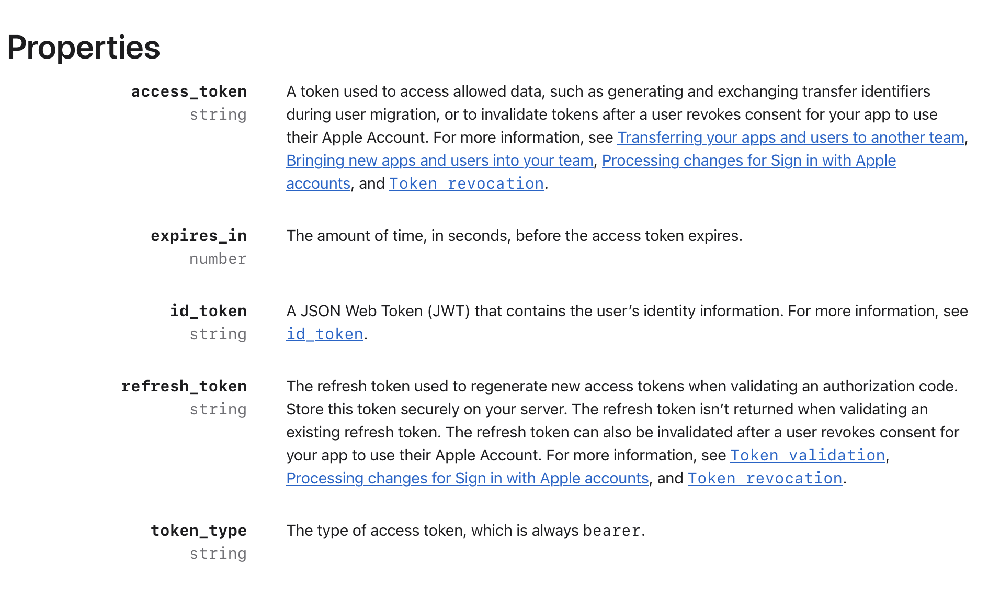

## 개요

진행중인 프로젝트에서 회원탈퇴 시 카카오/애플 계정과의 unlink의 다른 API 스펙 을 다룬 방법과, 선택한 저장소와 암호화에 대해서 다룬다.

---

## 1. 카카오 — 어드민 키만 있으면 된다

카카오의 연결 끊기 API(`POST /v1/user/unlink`)는 두 가지 인증 방식을 지원한다.

- 사용자 액세스 토큰: `Authorization: Bearer ${ACCESS_TOKEN}`
- **어드민 키**: `Authorization: KakaoAK ${ADMIN_KEY}` + body에 `target_id_type=user_id&target_id={회원번호}`

어드민 키 방식은 로그인 당시 발급받은 토큰을 저장해둘 필요가 없다.
`providerId`(카카오 회원번호)만 있으면 서버가 언제든 호출할 수 있다.
이 어드민 키는 로그인에 쓰는 REST API 키(Client ID)와는 다른, 앱 관리 콘솔에서 별도로 발급받는 키다.

```kotlin
@Component
@ConditionalOnProperty(name = ["kakao.unlink.admin-key"])
class KakaoUnlinkAdapter(
    private val kakaoWebClient: WebClient
) : SocialUnlinkPort {
    override fun unlink(providerId: String) {
        kakaoWebClient
            .post()
            .uri("/v1/user/unlink")
            .body(BodyInserters.fromFormData("target_id_type", "user_id").with("target_id", providerId))
            .retrieve()
            .toBodilessEntity()
            .block()
    }
}
```

---

## 2. 애플 — revoke에 로그인 당시 토큰이 반드시 필요하다

[애플의 revoke 엔드포인트](https://developer.apple.com/documentation/signinwithapplerestapi/revoke-tokens)(`POST /auth/revoke`)는 다르다.

`client_secret`(동적 서명 JWT)뿐 아니라 **로그인 당시 발급받은 `refresh_token`을 파라미터로 요구한다.**
- `providerId`만으로는 호출 자체가 안 된다.

문제는 이 프로젝트가 Apple의 refresh_token을 애초에 저장하고 있지 않았다는 것
- Spring Security의 OAuth2 로그인 흐름은 토큰 교환 응답을 받아서 우리 자체 세션 JWT로 바꾸는 데만 쓰고, `OAuth2AuthorizedClientRepository`를 커스텀 등록하지 않았으면 토큰은 요청 처리 중 잠깐 존재했다가 버려진다.

### 토큰 세 종류, 성격이 다 다르다
[참고 문서](https://developer.apple.com/documentation/signinwithapplerestapi/tokenresponse)



| 토큰 | 만료 | 실질 용도 |
|---|---|---|
| id_token | ~10분 (JWT `exp`) | 그 순간의 신원 증명, 즉시 소비되고 버림 |
| access_token | 3600초(1시간), 공식 문서상 "Reserved for future use" | 사실상 쓸 데가 없음 |
| **refresh_token** | **만료 없음** — revoke 전까지 유효 | revoke에 필요한 유일한 재료 |

`refresh_token`이 시간 기반으로 만료되지 않는다는 게 중요했다
- 로그인 시점에 한 번 잘 캡처해서 암호화 저장해두면, 몇 달 뒤 탈퇴 시점에도(계정 비밀번호 변경 등 예외가 없는 한) 여전히 유효하게 revoke에 쓸 수 있다.

### 캡처 지점 — `OAuth2AuthorizedClientRepository`

이 토큰을 손에 쥘 수 있는 유일한 지점이 `OAuth2AuthorizedClientRepository.saveAuthorizedClient(...)`다.

로그인 성공 직후 Spring Security가 자동으로 호출해주는데, 여기서 `authorizedClient.refreshToken`과 이미 매핑된 우리 도메인 `User`(→ `provider`, `providerId`)를 동시에 손에 넣을 수 있다.

```kotlin
@Component
@ConditionalOnProperty(name = ["aws.kms.key-id"])
class AppleTokenCapturingAuthorizedClientRepository(
    private val appleCredentialJpaRepository: AppleCredentialJpaRepository,
    private val tokenEncryptor: KmsEncryptor,
) : OAuth2AuthorizedClientRepository {

    override fun saveAuthorizedClient(authorizedClient: OAuth2AuthorizedClient, principal: Authentication, ...) {
        if (authorizedClient.clientRegistration.registrationId != "apple") return
        val refreshToken = authorizedClient.refreshToken?.tokenValue ?: return
        val user = (principal.principal as AuthenticatedUser).user

        // 같은 providerId로 이미 저장된 게 있으면(재로그인) 갱신, 없으면 신규 생성
        // — providerId에 unique 제약이 걸려 있어서 매번 새 id로 save()하면 재로그인 시 제약 위반이 난다
        val entity = appleCredentialJpaRepository.findByProviderId(user.providerId)
            ?.apply { this.encryptedRefreshToken = tokenEncryptor.encrypt(refreshToken) }
            ?: AppleCredentialJpaEntity(
                id = UuidGenerator.generate(),
                providerId = user.providerId,
                encryptedRefreshToken = tokenEncryptor.encrypt(refreshToken)
            )
        appleCredentialJpaRepository.save(entity)
    }

    override fun loadAuthorizedClient(...) = null // STATELESS 앱이라 읽기 경로는 안 씀
}
```

`loadAuthorizedClient`가 항상 `null`을 반환하는 이유는 이 앱이 세션리스(STATELESS) 인증 구조라 원래도 읽기용으로 쓸 일이 없기 때문이다.
이 컴포넌트는 순수하게 캡처(write) 전용이다.

### 참고 — 인터페이스 시그니처

`OAuth2AuthorizedClientRepository`([source](https://github.com/spring-projects/spring-security/blob/main/oauth2/oauth2-client/src/main/java/org/springframework/security/oauth2/client/web/OAuth2AuthorizedClientRepository.java))는 Spring Security 5.1부터 있던 표준 인터페이스다.

```java
public interface OAuth2AuthorizedClientRepository {
    <T extends OAuth2AuthorizedClient> @Nullable T loadAuthorizedClient(
        String clientRegistrationId, Authentication principal, HttpServletRequest request);

    void saveAuthorizedClient(OAuth2AuthorizedClient authorizedClient, Authentication principal,
        HttpServletRequest request, HttpServletResponse response);

    void removeAuthorizedClient(String clientRegistrationId, Authentication principal,
        HttpServletRequest request, HttpServletResponse response);
}
```

이 타입의 Bean을 커스텀 등록하면, `oauth2Login {}` DSL이 기본 구현(`HttpSessionOAuth2AuthorizedClientRepository`) 대신 자동으로 이걸 사용한다
- `SecurityConfig`에 별도로 `authorizedClientRepository = ...`를 지정하는 코드를 안 넣어도 된다.

---

## 3. 어디에 저장할 것인가 redis vs rds

이 값을 어디 저장할지는 [Redis vs RDB 판단 기준](/posts/redis-vs-rdb-loss-risk) 글의 기준을 그대로 적용해봤는데, 둘 다 걸렸다.

- **Redis가 애매한 이유**: 이 값은 계정이 살아있는 몇 년 동안 유실 없이 보존돼야 한다. 지금까지 이 프로젝트가 Redis를 쓰는 방식은 전부 "유실되어도 감내할 수 있는" TTL 데이터였는데, 여기엔 그 전제가 안 맞는다.
- **RDB가 애매한 이유**: OAuth refresh_token은 평문으로 컬럼에 넣기엔 너무 민감하다. 컬럼 레벨 암호화가 정석인데, 이 프로젝트엔 암호화 유틸리티가 전혀 없었다.

-> 결론은 "RDB + 암호화"였고, 암호화는 AWS KMS로 갔다.

---

## 4. 대칭키를 쓴 이유

- 비대칭키가 필요한 상황은 "암호화하는 쪽"과 "복호화하는 쪽"의 신뢰 수준이 다를 때다(공개키는 널리 배포하고 개인키만 보호).
  - 여기는 암호화(로그인 시점)도 복호화(탈퇴 시점)도 **같은 백엔드가 같은 IAM 권한으로** 수행한다 -> 비대칭키의 핵심 장점이 적용될 여지가 없다.

- 대칭키(AES-256)는 동등한 보안 강도를 내는 데 필요한 키 길이가 훨씬 짧다(AES-256 ≈ RSA 15360bit급).
- 데이터 저장소 암호화(at-rest encryption)는 업계 표준이 대칭키이기도 하고, KMS API 호출 비용도 symmetric이 더 싸다(10,000건당 $0.03 vs asymmetric $0.10).

```kotlin
@Component
@ConditionalOnProperty(name = ["aws.kms.key-id"])
class KmsEncryptor(
    private val kmsClient: KmsClient,
    private val kmsProperties: KmsProperties,
) {
    fun encrypt(plainText: String): String {
        val response = kmsClient.encrypt(
            EncryptRequest.builder().keyId(kmsProperties.keyId).plaintext(SdkBytes.fromUtf8String(plainText)).build()
        )
        return Base64.encode(response.ciphertextBlob().asByteArray())
    }

    fun decrypt(cipherText: String): String {
        val response = kmsClient.decrypt(
            DecryptRequest.builder().ciphertextBlob(SdkBytes.fromByteArray(Base64.decode(cipherText))).build()
        )
        return response.plaintext().asUtf8String()
    }
}
```

> 앱은 키 material을 절대 보지 않는다 -> KMS API(`Encrypt`/`Decrypt`) 두 개만 IAM 권한으로 호출한다.
> 
> 마스터 키는 AWS HSM 안에만 존재하고, DB가 통째로 유출돼도 KMS 접근 권한까지 같이 뚫리지 않는 한 복호화가 불가능하다.
> 
> 비용은 커스텀 관리 키 하나에 월 $1, API 호출은 월 20,000건까지 무료라 이 정도 저빈도 호출(유저당 로그인 1회 + 탈퇴 1회)엔 사실상 무시할 수준이다.

`decrypt` 요청엔 키 ID를 안 넘겨도 된다(ciphertext 안에 어떤 키로 암호화됐는지 메타데이터가 이미 포함돼 있다.)

---

## 5. 카카오·애플 둘 다 없는 로컬 환경 대비

두 어댑터 모두 필요한 설정값이 없으면 아예 Bean으로 등록되지 않도록 `@ConditionalOnProperty`를 걸었다.

```kotlin
@Configuration
@ConditionalOnProperty(name = ["aws.kms.key-id"])
@EnableConfigurationProperties(KmsProperties::class)
class KmsConfig { @Bean fun kmsClient(): KmsClient = ... }
```

여기서 중요한 건 **같은 조건을 여러 곳에 반복해서 걸어야 한다**는 점이다.

`@ConfigurationProperties` 바인딩은 그 값을 실제로 쓰는 Bean이 있든 없든 `@EnableConfigurationProperties`가 등록되는 순간 무조건 시도되기 때문에, Config 클래스 자체에도 조건을 걸지 않으면 프로퍼티가 없는 로컬 환경에서 앱이 아예 안 뜬다.

`KmsConfig`, `KmsEncryptor`, `AppleUnlinkAdapter`, `AppleTokenCapturingAuthorizedClientRepository` 전부 같은 `aws.kms.key-id` 조건을 달아야, 이 중 뭐 하나를 놓쳐도 애플 로그인 자체가 깨지는 걸 막을 수 있다.

---

## 요약

| 항목 | 선택 | 이유 |
|---|---|---|
| 카카오 unlink | 어드민 키 + providerId | 저장된 토큰 불필요, 로그인용 키와는 별개 키 |
| 애플 unlink | KMS로 암호화된 refresh_token 저장 | revoke API가 원본 refresh_token을 요구, providerId만으론 불가 |
| refresh_token 캡처 지점 | `OAuth2AuthorizedClientRepository.saveAuthorizedClient` | Apple registrationId만 필터링, User 매핑까지 끝난 시점 |
| 저장소 | RDB + KMS 암호화 | Redis는 장기 보존 전제에 안 맞고, RDB 평문은 너무 민감 |
| KMS 키 종류 | 대칭키(AES-256) | 암복호화 주체가 동일(같은 백엔드) — 비대칭키 장점이 적용 안 됨 |
| 설정 부재 대비 | `@ConditionalOnProperty`를 관련 Bean 전부에 반복 | 하나라도 빠지면 프로퍼티 부재 시 로그인 자체가 깨짐 |
